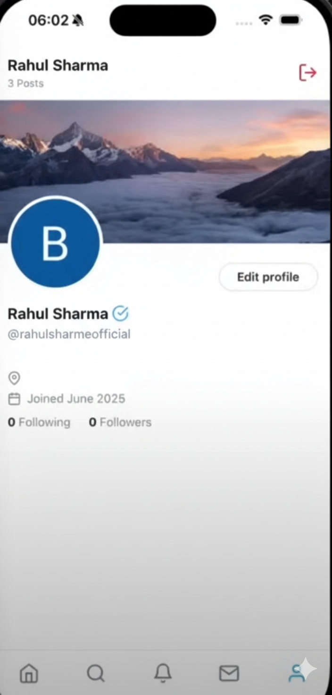

<h1 align="center">📱 Social Circle - React Native Project 🚀</h1>


<p align="center">
	
	
</p>

This project was created and developed by me. It is a fully functional social media app called Social Circle, inspired by X (formerly Twitter), built from scratch using React Native, Express.js, MongoDB, Clerk, Cloudinary, and Arcjet.

## 🚀 About This Project

I built this app to demonstrate my skills in full-stack mobile development. It includes:

- Authentication (Google/Apple ID via Clerk)
- Home screen to post text & images
- Like & comment system
- Notifications for likes & comments
- Messages tab with chat history
- Profile tab with editing
- Search tab for trending content
- Sign out functionality

## 🛠️ Technologies Used

- React Native (Expo)
- Express.js & MongoDB (Backend)
- Clerk (Authentication)
- Cloudinary (Image upload)
- Arcjet (Security)

## � Environment Setup

## 📁 .env Setup

### ⚙️ Backend (`/backend`)

```bash
PORT=5001
NODE_ENV=development

CLERK_PUBLISHABLE_KEY=<your_clerk_publishable_key>
CLERK_SECRET_KEY=<your_clerk_secret_key>
MONGO_URI=<your_mongodb_connection_uri>
ARCJET_ENV=development
ARCJET_KEY=<your_arcjet_api_key>
CLOUDINARY_CLOUD_NAME=<your_cloudinary_cloud_name>
CLOUDINARY_API_KEY=<your_cloudinary_api_key>
CLOUDINARY_API_SECRET=<your_cloudinary_api_secret>
```

### ⚙️ Mobile (`/mobile`)

```bash
EXPO_PUBLIC_CLERK_PUBLISHABLE_KEY=<your_clerk_publishable_key>
EXPO_PUBLIC_API_URL=<your_backend_api_url>
```

## 🏃‍♂️ How to Run

**Backend:**
```
cd backend
npm install
npm run dev
```

**Mobile:**
```
cd mobile
npm install
npx expo start
```

---

If you have any questions about this project, feel free to reach out!
